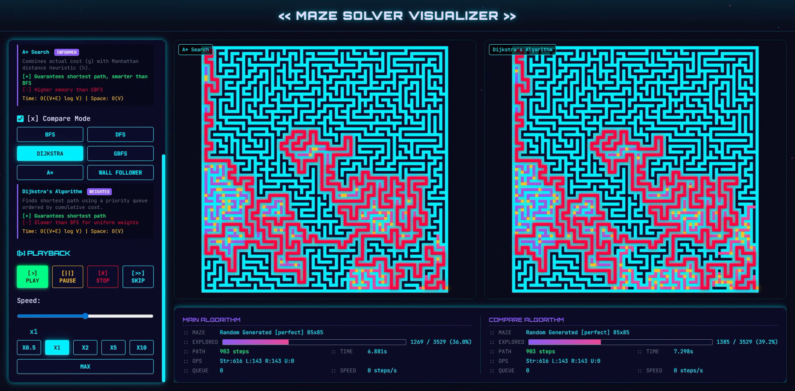
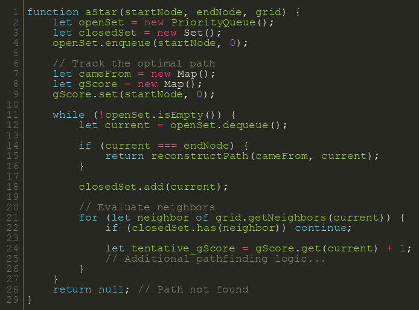

Maze Solver Visualizer
======================



A web-based, real-time visualization tool for pathfinding algorithms on perfect and imperfect mazes.

This project provides a comprehensive environment to experiment with graph algorithms, observe their behavior, and compare their efficiency. It includes a dataset of over 3,000 pre-generated mazes and features a custom HTML5 canvas renderer capable of handling large-scale grids (up to 145x145).

Features
--------

- Multiple algorithmic implementations: Breadth-First Search (BFS), Depth-First Search (DFS), Dijkstra's Algorithm, A* Search, Greedy Best-First Search, and Wall Follower.
- Side-by-side comparative execution of algorithms.
- Custom dataset of 3,000+ packed and base64-encoded mazes.
- Real-time performance tracking (operations, path length, explored nodes, queue size, execution speed).
- Pure vanilla HTML/CSS/JavaScript implementation with no heavy frontend framework dependencies.


Project structure
-----------------

- `data/` - Contains the raw and processed maze datasets.
- `models/` - Jupyter notebooks and evaluation scripts for offline algorithm testing.
- `scripts/` - Python utilities for processing and packing text-based maze files.
- `src/` - The core web application source code.
- `maze_data_sample.js` - Sample data payload.


Algorithm complexity
--------------------

| Algorithm | Time Complexity | Space Complexity | Description |
|-----------|-----------------|------------------|-------------|
| BFS | O(V + E) | O(V) | Explores neighbors layer by layer; guarantees shortest path in unweighted graphs. |
| DFS | O(V + E) | O(V) | Dives into a path before backtracking; does not guarantee shortest path. |
| Dijkstra | O(E log V) | O(V) | Priority queue-based shortest path search for weighted graphs. |
| A* Search | O(E log V) | O(V) | Heuristic-driven shortest path search (e.g., Manhattan distance). |
| Greedy | O(E log V) | O(V) | Heuristic-driven fast pathfinding; does not guarantee optimal paths. |
| Wall Follower | O(V) | O(1) | Rule-based traversal for simply connected mazes. |


Code architecture
-----------------

The pathfinding logic operates independently from the canvas rendering pipeline. To run a pathfinding iteration, initialize the algorithm module with the parsed maze state. 




Installation and usage
----------------------

The application requires no build steps or external dependencies for the web interface.

1. Clone the repository locally.
2. Navigate to the `src/` directory.
3. Open `index.html` in a web browser.

To serve the application via a local HTTP server:

```bash
cd src
python -m http.server 8000
```


Generating new mazes
--------------------

To integrate custom mazes into the visualizer dataset:

1. Place raw `.txt` maze files inside `data/raw/perfect_maze/` or `data/raw/imperfect_maze/`.
2. Execute the packing script:

```bash
python scripts/embed_mazes.py
```

The script will update `data/processed/maze_data.js` and the web application will reflect the new dataset upon reload.


License
-------

This project is released under the MIT License.
